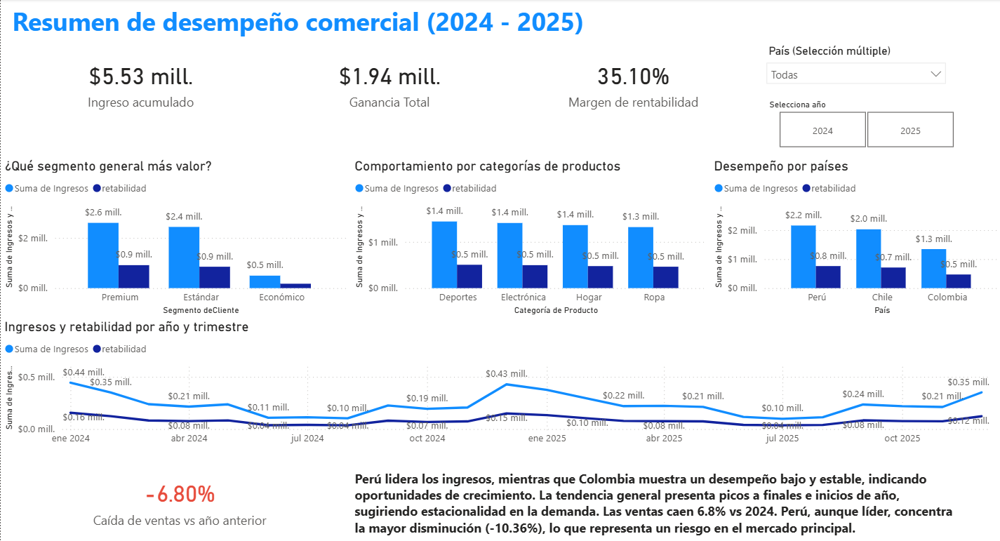
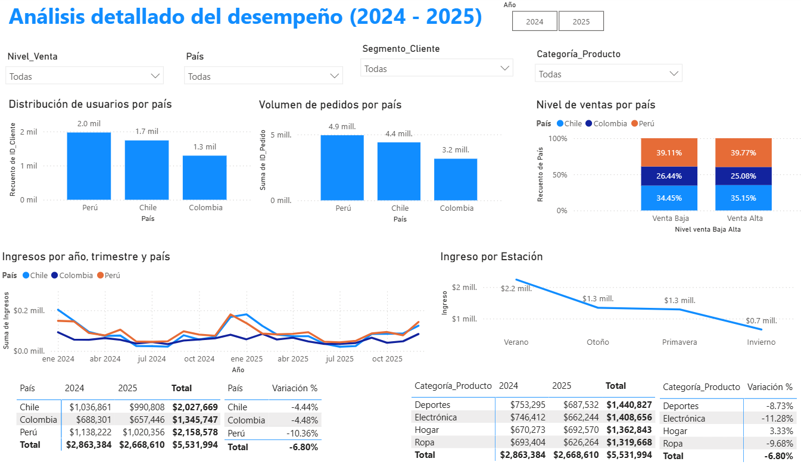

# 📊 Andes Retail Group: Commercial Performance Dashboard (2024–2025)

This project presents an **interactive Power BI dashboard** developed for **Andes Retail Group**, a retail company operating in **Peru, Chile, and Colombia**.

The dashboard was designed to provide an executive view of commercial performance between **2024 and 2025**, helping decision-makers understand trends in **sales, profitability, customer segments, product categories, and geographic performance**.

The project combines **interactive dashboards, KPI monitoring, business storytelling, and executive reporting** to support data-driven decisions.

---

## 📌 Business Objective

The executive team needed a clear and interactive dashboard to answer strategic business questions such as:

- How has total revenue evolved between **2024 and 2025**?
- Which customer segments generate the highest revenue and profitability?
- Which product categories have the greatest business impact?
- Are there relevant differences across countries or regions?
- What seasonal or temporal patterns exist?
- Where could commercial improvement opportunities be found?

---

## 🛠 Tools & Technologies

- Power BI
- DAX
- Power Query
- Data Modeling
- Data Visualization
- Business Intelligence

---

## 🔍 Dashboard Structure

### 1. Executive Overview

The first dashboard page was designed to provide a quick and high-level understanding of business performance.

It includes:

- KPI cards for **revenue, profit, and profitability margin**
- commercial performance trends over time
- customer segment analysis
- product category comparison
- country performance analysis
- dynamic filters by country and year

The goal was to allow executives to understand the overall business situation in just a few seconds.

---

### 2. Detailed Analysis

The second dashboard page focuses on deeper business exploration and diagnostic analysis.

It includes:

- sales distribution by country
- customer segmentation
- product category performance
- seasonal analysis
- year-over-year variation (YoY)
- dynamic filtering capabilities

This view supports deeper analytical exploration and opportunity detection.

---

## 📊 Dashboard Preview

### Executive Overview

Executive dashboard designed to provide a quick understanding of commercial performance through KPIs, segmentation, product category analysis, and business evolution over time.

---

### Detailed Analysis

Dashboard view focused on business diagnosis, allowing deeper exploration of customer behavior, category performance, seasonal trends, and country-level differences.

---

## 📈 Key Findings

- **Peru generated the highest total revenue**, although it also showed the largest year-over-year decline.
- **Colombia showed lower but relatively stable performance**, suggesting commercial growth opportunities.
- Sales demonstrate **seasonality**, with stronger performance during specific periods of the year.
- Product categories and customer segments show differentiated performance patterns.
- The business experienced an overall **-6.80% decline between 2024 and 2025**.

---

## 💡 Business Recommendations

The analysis suggests opportunities to:

- strengthen commercial strategies in Peru
- explore growth opportunities in Colombia
- review lower-performing product categories
- better leverage seasonal demand periods
- adapt commercial strategies according to customer segment

---

## 🎯 Key Skills Demonstrated

- Power BI Dashboard Development
- Business Intelligence
- KPI Monitoring
- Data Modeling
- DAX Measures
- Executive Reporting
- Business Storytelling
- Data Visualization

---

## 📁 Files Included

- Power BI dashboard (`.pbix`)
- Dashboard screenshots
- Project documentation

---

## 🔗 Portfolio

- Notion Portfolio: https://www.notion.so/Andes-Retail-Group-Dashboard-de-desempe-o-comercial-2024-2025-36cddeb9784680969f32da589212348e?source=copy_link
